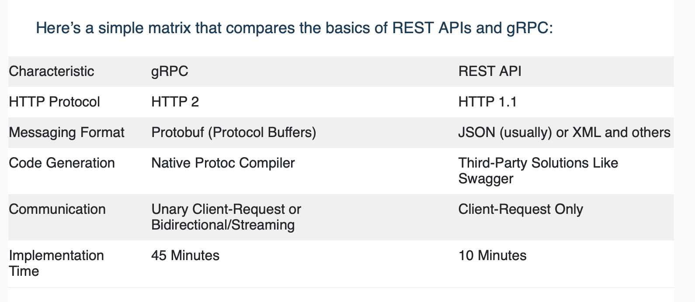
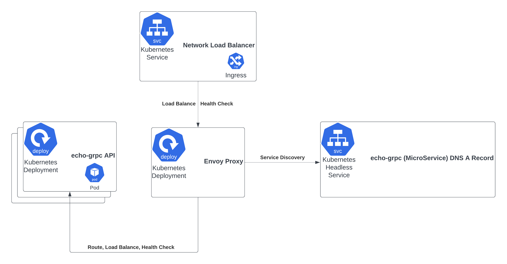
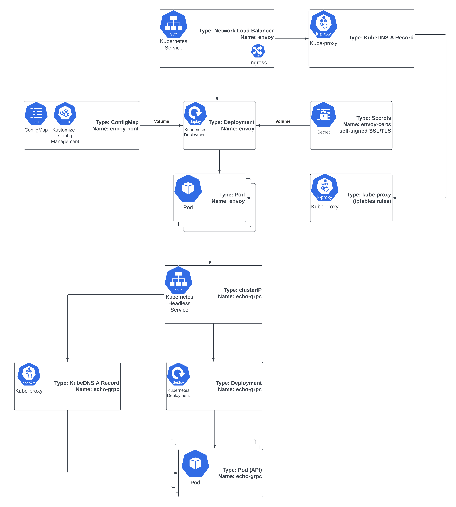

# Load-Balance multiple gRPC Services on GKE using Envoy Proxy. 

This tutorial mirrors [GCP](https://cloud.google.com) Documentation for [Load Balancing gRPC Services on GKE using Envoy Proxy](https://cloud.google.com/kubernetes-engine/docs/tutorials/exposing-grpc-services-on-gke-using-envoy-proxy).

The way it ***differs*** from the GCP Documentation is that this solution is built purely using `Dart`. The official documentation covers implementation using `Go` or `Python`. And hence is able to leverage a lot of highly maintained libraries. 
This however is built purely using `Dart` because for my love for the community and also to fill in some of the shortcomings on the official documentation on both [gRPC](https://grpc.io) and [Google's Kubernetes Engine](https://cloud.google.com/kubernetes-engine).
Some of the implementation is crude and is not automated. If there are enough interests, I would be happy to write out a CI/CD pipe-line using [Cloud Build](https://cloud.google.com/build) and `Github` as an example.

## Prerequisites

1. A beginner's understanding of Kubernetes.. If you have never deployed a service, web app, etc. on Kubernetes I highly recommend: [GCP Documentation to deploy a simple app to GKE](https://cloud.google.com/kubernetes-engine/docs/deploy-app-cluster). Once you have completed it, you should have enough familiarity of interacting with GKE for the rest of this tutorial.
2. A good understanding of Containers. We will be building our `Dart Server` as a container image that is deployed on [GCP Artifact Registry](https://cloud.google.com/artifact-registry?hl=en). We use this instead of `Docker Hub` because this tutorial wishes to keep some of the security elements secure within limited permissions boundary (following cloud best practices).
3. A Gmail Account with which you can sign-up for GCP and have a project that is ***billing enabled***. Follow the official [GCP documentation link](https://cloud.google.com/kubernetes-engine/docs/tutorials/exposing-grpc-services-on-gke-using-envoy-proxy) for the pre-requisite section and come back to this tutorial.
4. A very good understanding of Dart. A lot of the implementation both client and server side for `gRPC` is written using boiler plate code generated by `protoc` [Protocol Buffers](https://protobuf.dev). This is the core of of `gRPC`. But we will be customizing a lot of things in relation to the official documentation. And we need a good understanding of `dart` foundations in order to follow along. Don't worry! If I can figure it out, so can you! :)
5. An interest to learn [gRPC](https://grpc.io). A large part of Google Cloud Platform APIs are built using ***Protocol Buffers***. It's a powerful RPC (Remote Procedure Call) framework that is built for highly distributed systems. It is is able to support HTTP2/Transcoding that can be used as REST API making the API far more optimized than traditional REST APIs^1^. It supports strong typing, serialization, very low latency since it uses HTTP2 that uses multiplexed streams. However, these are only useful when you have small microservices that are doing atomic operations. Please look into the official documentation for all the design anti patterns. Below is a simple comparison of gRPC vs Rest API.

## Architecture

Below diagrams depict an architectural overview of what we are trying to achieve. 

Figure: Architectural overview of Cloud Deployment (Server side API)

## References
[1] [Google's official comparison](https://cloud.google.com/blog/products/api-management/understanding-grpc-openapi-and-rest-and-when-to-use-them)
